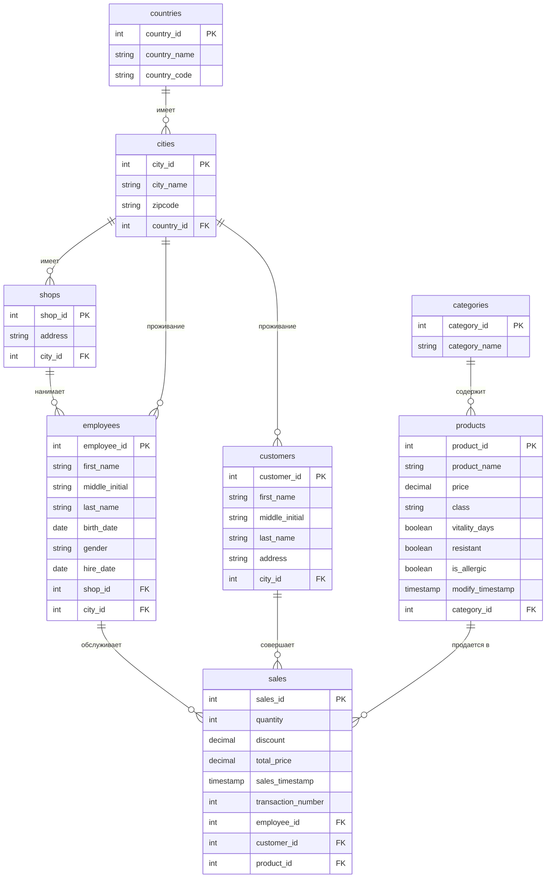

# ER-диаграмма (логическая модель)

```mermaid
erDiagram
    countries ||--o{ cities : "имеет"
    cities ||--o{ shops : "имеет"
    shops ||--o{ employees : "нанимает"
    employees ||--o{ sales : "обслуживает"
    customers ||--o{ sales : "совершает"
    products ||--o{ sales : "продается в"
    categories ||--o{ products : "содержит"
    cities ||--o{ employees : "проживание"
    cities ||--o{ customers : "проживание"

    countries {
        int country_id PK
        string country_name
        string country_code
    }

    cities {
        int city_id PK
        string city_name
        string zipcode
        int country_id FK
    }

    shops {
        int shop_id PK
        string address
        int city_id FK
    }

    employees {
        int employee_id PK
        string first_name
        string middle_initial
        string last_name
        date birth_date
        string gender
        date hire_date
        int shop_id FK
        int city_id FK
    }

    customers {
        int customer_id PK
        string first_name
        string middle_initial
        string last_name
        string address
        int city_id FK
    }

    categories {
        int category_id PK
        string category_name
    }

    products {
        int product_id PK
        string product_name
        decimal price
        string class
        boolean vitality_days
        boolean resistant
        boolean is_allergic
        timestamp modify_timestamp
        int category_id FK
    }

    sales {
        int sales_id PK
        int quantity
        decimal discount
        decimal total_price
        timestamp sales_timestamp
        int transaction_number
        int employee_id FK
        int customer_id FK
        int product_id FK
    }
```