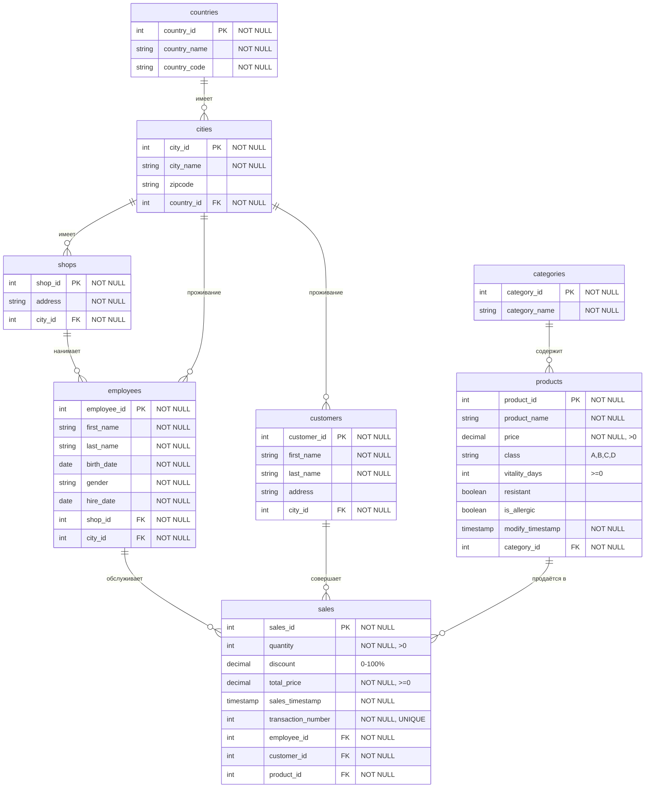

# Физическая ER-диаграмма

```mermaid
erDiagram
    countries ||--o{ cities : "имеет"
    cities ||--o{ shops : "имеет"
    shops ||--o{ employees : "нанимает"
    employees ||--o{ sales : "обслуживает"
    customers ||--o{ sales : "совершает"
    products ||--o{ sales : "продаётся в"
    categories ||--o{ products : "содержит"
    cities ||--o{ employees : "проживание"
    cities ||--o{ customers : "проживание"

    countries {
        int country_id PK "NOT NULL"
        string country_name "NOT NULL"
        string country_code "NOT NULL"
    }

    cities {
        int city_id PK "NOT NULL"
        string city_name "NOT NULL"
        string zipcode
        int country_id FK "NOT NULL"
    }

    shops {
        int shop_id PK "NOT NULL"
        string address "NOT NULL"
        int city_id FK "NOT NULL"
    }

    employees {
        int employee_id PK "NOT NULL"
        string first_name "NOT NULL"
        string last_name "NOT NULL"
        date birth_date "NOT NULL"
        string gender "NOT NULL"
        date hire_date "NOT NULL"
        int shop_id FK "NOT NULL"
        int city_id FK "NOT NULL"
    }

    customers {
        int customer_id PK "NOT NULL"
        string first_name "NOT NULL"
        string last_name "NOT NULL"
        string address
        int city_id FK "NOT NULL"
    }

    categories {
        int category_id PK "NOT NULL"
        string category_name "NOT NULL"
    }

    products {
        int product_id PK "NOT NULL"
        string product_name "NOT NULL"
        decimal price "NOT NULL, >0"
        string class "A,B,C,D"
        int vitality_days ">=0"
        boolean resistant
        boolean is_allergic
        timestamp modify_timestamp "NOT NULL"
        int category_id FK "NOT NULL"
    }

    sales {
        int sales_id PK "NOT NULL"
        int quantity "NOT NULL, >0"
        decimal discount "0-100%"
        decimal total_price "NOT NULL, >=0"
        timestamp sales_timestamp "NOT NULL"
        int transaction_number "NOT NULL, UNIQUE"
        int employee_id FK "NOT NULL"
        int customer_id FK "NOT NULL"
        int product_id FK "NOT NULL"
    }
```